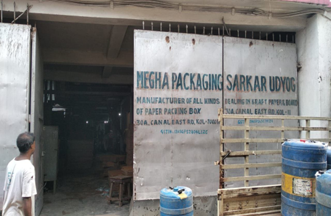
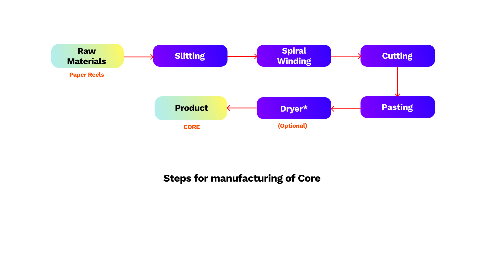
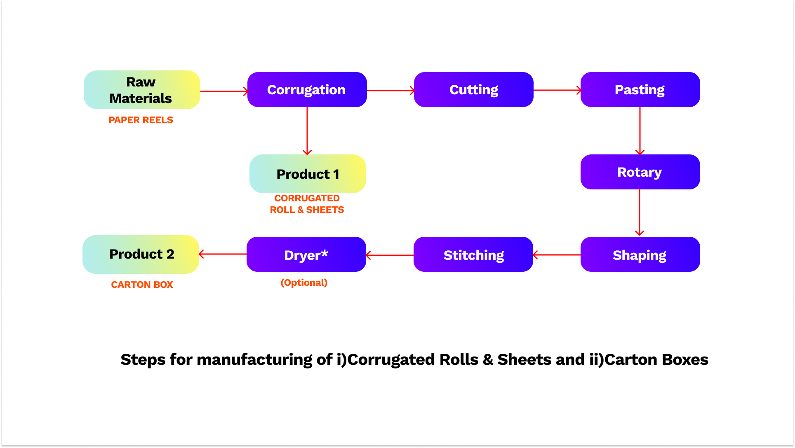
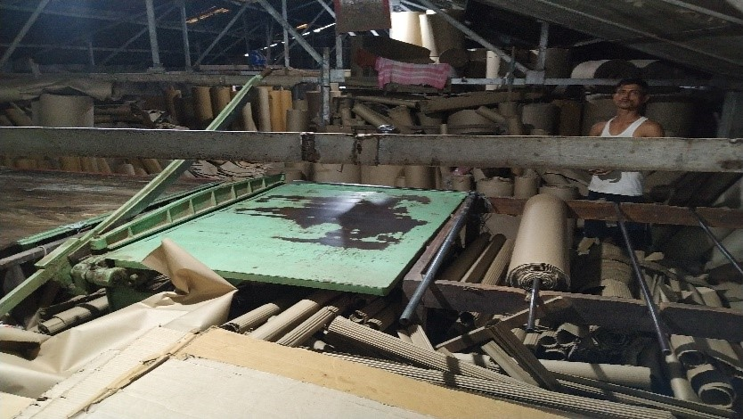
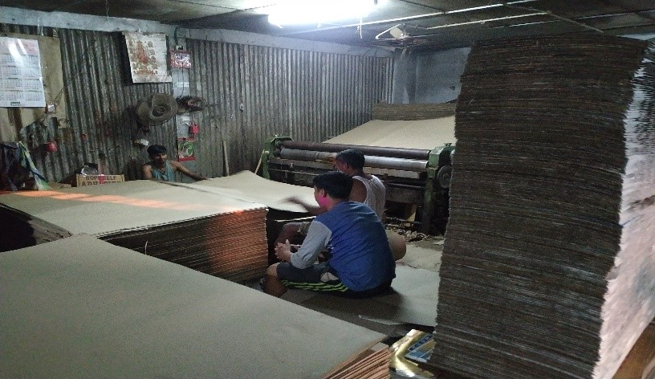
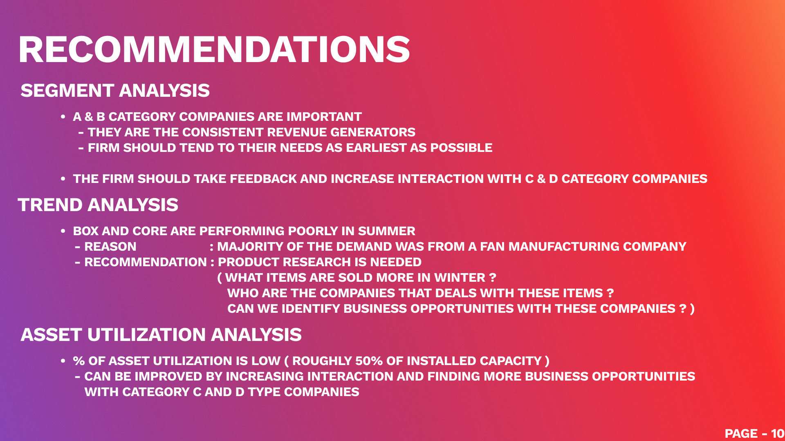

# An Analysis of a Corrugated Box Manufacturing Firm

 **A comprehensive data analysis of a real time manufacturing firm based in Kolkata**

> [!NOTE]
> This is a project done as part of the **BSMS2001P Business Data Manegement (BDM)** course at **IIT Madras** [^1] [^2]
>
> As part of the course, I have chosen to analyze the data of a **corrugated box manufacturing firm** based in Kolkata. The data was collected from the firm's accounting software and was analyzed upon discussing with the firm's owner on the pain points.
>
> The analysis was done in **two parts**. After each part, the f**indings were discussed with the owner** and finally several **recommendations were made to improve the firm's operations**.

## Introduction

Corrugated boxes are made by **layering corrugated cardboard sheets**, which provide **cushioning** to protect the contents. They offer numerous advantages such as **strength**, **lightweight**, **flexibility**, **durability**, and **aesthetic appeal**. They are eco-friendly and widely used in various industries including **food and beverages**, **chemicals**, **electronics**, **textiles**, and more. The demand for corrugated boxes is **increasing globally due to the rise of multiple end-use sectors** and the **growth of e-commerce**. **Customized packaging** and **product-specific** corrugated boxes are driving further growth in the market by providing **tailored protection against mechanical stress**.



**Megha Packaging**, a small manufacturing company based in Kolkata, specializes in producing **corrugated boxes, cores, rolls**, and **corrugated board**, alongside **spindle** and **reel** products. Their focus is on providing **packaging solutions**, particularly in the segment of **corrugated boxes**. The company operates by procuring raw materials from the market only after receiving orders from clients.

These raw materials undergo several processing stages (ref. pic. below) to be transformed into the desired products, including **corrugated rolls & sheets**, **corrugated carton boxes**, and **cores**.

### Reference pics. of the manufacturing process

- ***Core***



- ***Corrugated Rolls & Sheets; Carton Boxes***



- ***Images of the manufacturing process at Megha Packaging***




## Data Collection

The data was stored within **Tally Software**, a popular accounting software used by small and medium-sized businesses. The data was **exported** in the form of an **Excel** file, which was then cleaned and transformed for analysis.

Data for 3 financial years was collected, including the **financial year 2019-20**, **2020-21**, and **2021-22**.
The raw data was stored in **3 separate folders** for each financial year, containing multiple Excel files for each month.

### Steps to retrieve the final dataset

- ***Extracting the data from zip file***

```bash
cd data
bzip2 -d raw_data.tar.bz2 # Extract the tar file
tar -xvf raw_data.tar # Extract the raw data files
```

- ***Create new directories for the cleaned data***

```bash
# Here the cleaned data for each financial year will be stored
mkdir 19-20csv 20-21csv 21-22csv
```

- ***Convert the raw data files to csv format***

```bash
# script requires pandas and openpyxl
pip install pandas
pip install openpyxl
```

```bash
# upgrade openpyxl to the latest version if already installed
pip install --upgrade openpyxl
```

```bash
python3 xlsx_to_csv.py
```

Remember to change the `source_path` and `destination_path` in the script for all the three extracted files.

eg

```python
# For fetching the data for FY 19-20
source_path = "./Raw_data/ALL BILLS 19-20_Megha Sales"
destination_path = "./19-20csv"
# For fetching the data for FY 19-20
source_path = "./Raw_data/ALL Bills 20-21_Megha_Sales"
destination_path = "./20-21csv"
# For fetching the data for FY 19-20
source_path = "./Raw_data/ALL BILLS 21-22_Megha Sales"
destination_path = "./21-22csv"
```

- ***Fetch the relevant data into a final csv file***

```bash
./csv_generate.sh 19-20csv > final_data.csv
# Repeat the above command for the other two folders and append the results
./csv_generate.sh 20-21csv >> final_data.csv
./csv_generate.sh 21-22csv >> final_data.csv
```

**Now the file `final_data.csv` contains the cleaned data for all the three financial years. This file was used for data analysis.**

## Data Analysis

The data analysis was performed using

- **Excel**
- **Tableau**

See the file [data_analysis.xlsx](data_analysis.xlsx) for the detailed analysis done using Excel.

### All documents related to the data analysis and reporting

- [The Excel file containing the data analysis](./docs/data_analysis.xlsx)
- [Project Proposal submitted to IIT Madras](./docs/project_proposal_21f1002696.pdf)
- [Final Project Report submitted to IIT Madras](./docs/Final_Submission_21f1002696.pdf)

## Recommendations made


***See the entire presentation [here](https://docs.google.com/presentation/d/1_04Hkw_MumzDKpdBI-yTcSDIhod6nKuRis1OB3FdxX0)***

## Final Words

- The findings were discussed with the owner
- Recommendations were acknowledged and the owner was happy with the insights provided
- An interview was set up with a working professional in this field to evaluate the analysis


[^1]: [BSMS2001P Course Page](https://study.iitm.ac.in/ds/course_pages/BSMS2001P.html)
[^2]: [IIT Madras](https://study.iitm.ac.in/ds/index.html)
